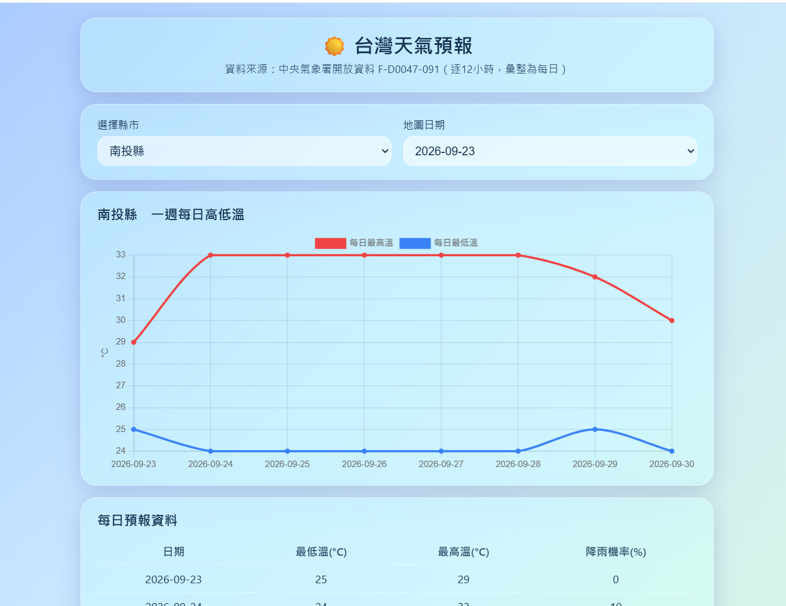

# 台灣天氣預報網站（Taiwan Weather Forecast）

使用中央氣象署（CWA）開放資料 `F-D0047-091`（未來一週逐 12 小時預報），彙整成
**每日最高／最低溫與降雨機率**，提供互動式查詢：縣市選單、每日高低溫折線圖、
資料表、全台溫度地圖，以及「降雨機率 > 50% 提醒帶傘」。介面採 iOS 液態玻璃風格。

## 網頁示意


## 兩種可執行版本

本專案提供兩套並存的前端，共用相同的資料解析與每日彙整邏輯：

| 版本 | 進入點 | 部署平台 | 說明 |
|------|--------|----------|------|
| **Streamlit 版** | `streamlit_app.py` + `backend/` + `frontend/` | Streamlit Community Cloud | 單體式、含 SQLite 快取、可本機 `streamlit run` |
| **Vercel 版** | `public/` + `api/` | Vercel | 靜態前端 + Python 無伺服器函式，直接讀 CWA（無資料庫）|

> 為什麼有兩套？**Vercel 無法執行 Streamlit**（需要常駐伺服器）。要上 Vercel 必須用
> 靜態前端 + serverless 函式，因此另做 Vercel 版；Streamlit 版則適合 Streamlit Cloud。

## 功能

- 縣市選單（22 縣市，以 CWA 行政區代碼 geocode 識別，不混淆同名）。
- 一週每日高低溫折線圖（由逐 12 小時時段彙整為每日 MIN/MAX）。
- 每日預報資料表（最低溫、最高溫、降雨機率）。
- 全台各縣市當日最高溫地圖（含溫度顏色圖例），日期選單只列出有資料的日期。
- 帶傘提醒：所選地區任一日降雨機率 > 50% 時，首頁顯示提醒。
- 顯示資料最後更新時間、預報單位；無資料／API 失敗時顯示友善訊息。

## 資料定義（已用真實 API 核對，詳見 [DECISIONS.md](./DECISIONS.md)）

- 資料集 `F-D0047-091`：新版大寫結構 `records.Locations[0].Location[]`，Location 為 **22 縣市**。
- 溫度／降雨欄位（中文）：`最高溫度`、`最低溫度`、`12小時降雨機率`。
- 缺值以 `"-"` 表示，解析時一律轉為 `None`（不當 0）。
- **保留原始 12 小時時段**，唯一鍵 `(geocode, startTime, endTime)`；畫面以每日彙整呈現。
- 地圖座標優先使用 CWA 回應提供的 `Latitude`/`Longitude`。

---

## 本機執行（Streamlit 版）

> 本機請使用標準 CPython（本專案在 Windows 用 `py -3.12`；MSYS2/MinGW 版 Python 無法安裝 wheel）。

### 1. 安裝套件
```powershell
py -3.12 -m pip install -r requirements.txt
```
Linux/macOS：
```bash
python3 -m pip install -r requirements.txt
```

### 2. 設定授權碼
複製 `.env.example` 為 `.env`，填入你的授權碼：
```
CWA_API_KEY=你的中央氣象署授權碼
```
（到 https://opendata.cwa.gov.tw 會員專區免費取得。）

### 3. 抓取資料
```powershell
py -3.12 update_data.py            # 從真實 API 抓取，寫入 data.db
py -3.12 update_data.py --demo     # 無授權碼時用示範資料（畫面會標示為示範）
```

### 4. 啟動網站
```powershell
py -3.12 -m streamlit run streamlit_app.py
```
（Windows 也可直接雙擊 `run_app.bat`。）瀏覽器開 `http://localhost:8501`。

> app 啟動時會自動確認資料表存在、資料過舊時自動更新（`bootstrap.py`）。

## 測試
```powershell
py -3.12 -m pytest -q
```
測試涵蓋：同日多時段不覆蓋、重複更新不重複、跨縣市同名區分、缺值處理、
API 失敗保留舊資料、帶傘判斷。

## 環境變數
| 變數 | 說明 | 預設 |
|------|------|------|
| `CWA_API_KEY` | 中央氣象署授權碼（必填）| 無 |
| `WEATHER_DB_PATH` | SQLite 檔案位置（可選）| 專案內 `data.db` |

---

## 部署

### A. Streamlit Community Cloud（Streamlit 版）
1. 程式碼推上 GitHub。
2. 到 https://share.streamlit.io 匯入 repo，主程式選 `streamlit_app.py`。
3. 在 App 的 **Settings → Secrets** 設定 `CWA_API_KEY`（雲端不讀 `.env`）。
4. Deploy。
   - 注意：Community Cloud 的 SQLite 是暫存，容器重啟會清空，app 啟動時會自動重抓。

### B. Vercel（Vercel 版）
完整步驟見 **[DEPLOY_VERCEL.md](./DEPLOY_VERCEL.md)**。摘要：
1. 程式碼推上 GitHub（含 `api/`、`public/`、`vercel.json`）。
2. 在 Vercel 匯入 repo，Framework 選 **Other**。
3. **Settings → Environment Variables** 設定 `CWA_API_KEY`。
4. Deploy，取得 `https://你的專案.vercel.app`。

---

## 專案結構

```
streamlit_app.py       # Streamlit 主程式（架構 A；改名自 app.py 以避免 Vercel 誤判）
bootstrap.py           # 初始化 + 自動更新
update_data.py         # 抓取 CWA -> 寫入 SQLite（可重複執行、失敗保留舊資料）
backend/
  fetcher.py           # 抓取＋解析（timeout、HTTP 錯誤、時間鍵配對、缺值處理、驗證）
  database.py          # SQLite 建表、參數化查詢、upsert（唯一鍵防重複）
  service.py           # UI 查資料的單一入口（每日彙整、可用日期、帶傘判斷）
frontend/
  styles.py            # 液態玻璃 CSS（用 st.container(key=) 穩定容器）
  components.py        # 折線圖、表格、地圖（含圖例）、帶傘提醒
data/geo.py            # geocode -> 座標 備援對照表
tests/                 # pytest 測試 + 示範資料 fixture
api/                   # ★ Vercel 版：Python 無伺服器函式
  _cwa.py              #   輕量 CWA 存取＋解析＋每日彙整（只依賴 requests）
  forecast.py          #   /api/forecast 端點
  requirements.txt     #   函式依賴
public/                # ★ Vercel 版：靜態前端（index.html / app.js / styles.css）
vercel.json            # Vercel 設定
DECISIONS.md           # 資料結構驗證與 schema 決策
DEPLOY_VERCEL.md       # Vercel 部署教學
design.md / workflow.md# 設計與工作流程文件
```

## 已知限制

- 僅使用 F-D0047-091（一週逐 12 小時，彙整為每日）；未含即時觀測、AQI、地震等。
- Streamlit 版的 SQLite 在雲端為暫存；Vercel 版無資料庫、每次即時抓取＋短期快取。
- 地區為縣市層級（此資料集 Location 即縣市，無鄉鎮細分）。
- 完整無障礙（WCAG）合規仍需以輔助科技實測與專家審查驗證。

## 資料來源與授權

- 中央氣象署開放資料平台：https://opendata.cwa.gov.tw
- 資料採政府資料開放授權，使用時請標示來源。本專案僅供學習展示，實際數據以官方公告為準。
